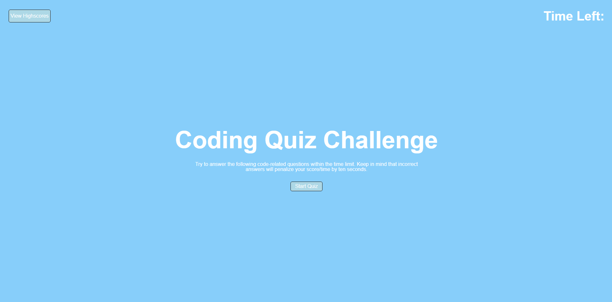

# WebAPIs-Code-Quiz

## Task

For this challenge, I was given the task of creating a timed quiz on JavaScript fundamentals that scores the user's high scores so they can gauge their progress compared to their peers.

## Acceptance Criteria

```
GIVEN I am taking a code quiz
WHEN I click the start button
THEN a timer starts and I am presented with a question
WHEN I answer a question
THEN I am presented with another question
WHEN I answer a question incorrectly
THEN time is subtracted from the clock
WHEN all questions are answered or the timer reaches 0
THEN the game is over
WHEN the game is over
THEN I can save my initials and my score
```

## Submission

GitHub Repo URL: https://github.com/r-r-i/WebAPIs-Code-Quiz  Deployed URL: https://r-r-i.github.io/WebAPIs-Code-Quiz/

## Quiz Home Screen

